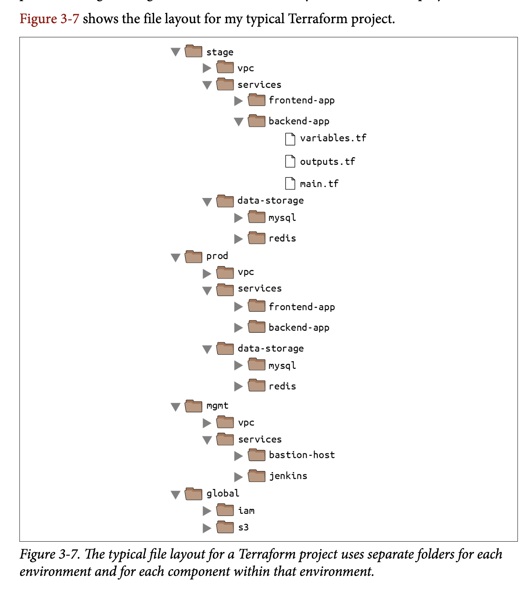
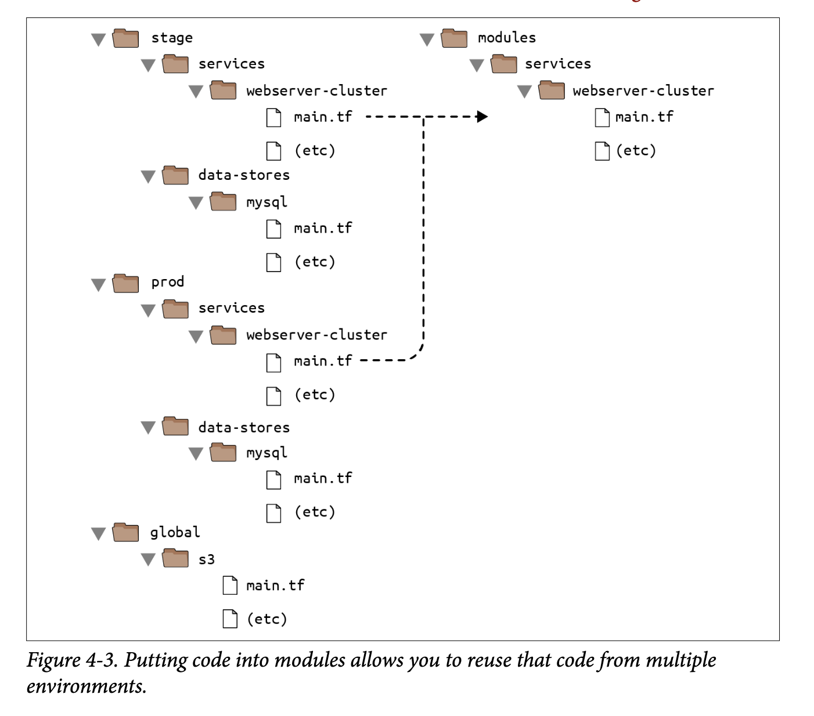
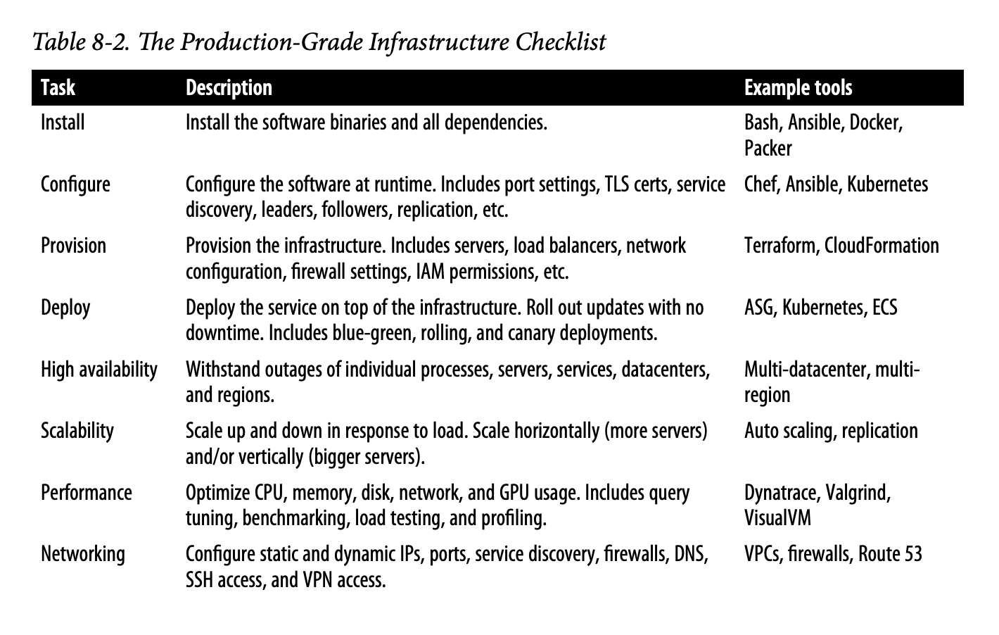
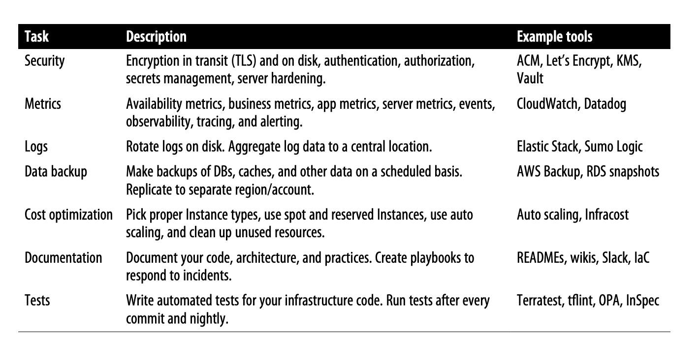

# Terraform Commands List

Here's a list of basic Terraform commands you should familiarize yourself with:

- `terraform init` - Initializes a new or existing Terraform configuration.
- `terraform fmt` - Rewrites Terraform configuration files to a canonical format and style.
- `terraform validate` - Validates the Terraform configuration files in a directory.
- `terraform plan` - Creates an execution plan.
- `terraform apply --auto-approve` - Applies the changes required to reach the desired state of the configuration, and then automatically approves the execution.
- `terraform import` - If you created infrastructure before you started using Terraform, you can use
  the terraform import command to add that infrastructure to Terraform’s state
  file so that Terraform is aware of and can manage that infrastructure.

## Isolation via File Layout

To achieve full isolation between environments, you need to do the following:

- Put the Terraform configuration files for each environment into a separate folder. For example, all of the configurations for the staging environment can be in a folder called `stage` and all the configurations for the production environment can be in a folder called `prod`.
- Configure a different backend for each environment, using different authentication mechanisms and access controls: e.g., each environment could live in a separate AWS account with a separate S3 bucket as a backend.

Diagram:



At the top level, there are separate folders for each "environment." The exact environments differ for every project, but the typical ones are as follows:

- `stage` - An environment for pre-production workloads (i.e., testing)
- `prod` - An environment for production workloads (i.e., user-facing apps)
- `mgmt` - An environment for DevOps tooling (e.g., bastion host, CI server)
- `global` - A place to put resources that are used across all environments (e.g., S3, IAM)

Within each environment, there are separate folders for each "component." The components differ for every project, but here are the typical ones:

- `vpc` - The network topology for this environment.
- `services` - The apps or microservices to run in this environment, such as a Ruby on Rails frontend or a Scala backend. Each app could even live in its own folder to isolate it from all the other apps.
- `data-storage` - The data stores to run in this environment, such as MySQL or Redis. Each data store could even reside in its own folder to isolate it from all other data stores.

Within each component, there are the actual Terraform configuration files, which are organized according to the following naming convention:

- `variables.tf` - Input variables
- `outputs.tf` - Output variables
- `main.tf` - Resources and data sources

Here are just a few examples:

- `dependencies.tf` - It’s common to put all your data sources in a dependencies.tf file to make it easier to see what external things the code depends on.
- `providers.tf` - You may want to put your provider blocks into a providers.tf file so you can see, at a glance, what providers the code talks to and what authentication you’ll have to provide.
- `main-xxx.tf` - If the main.tf file is getting really long because it contains a large number of resources, you could break it down into smaller files that group the resources in some logical way: e.g., main-iam.tf could contain all the IAM resources, main-s3.tf could contain all the S3 resources, and so on. Using the main- prefix makes it easier to scan the list of files in a folder when they are organized alphabetically, as all the resources will be grouped together. It’s also worth noting that if you find yourself managing a very large number of resources and struggling to break them down across many files, that might be a sign that you should break your code into smaller modules instead.

## Terraform remote state Data source

For setting up the secrets.. use

```bash
export TF_VAR_db_username="(YOUR_DB_USERNAME)"
export TF_VAR_db_password="(YOUR_DB_PASSWORD)"

```

And here is how you do it on Windows systems:

```powershell
set TF_VAR_db_username="(YOUR_DB_USERNAME)"
set TF_VAR_db_password="(YOUR_DB_PASSWORD)"
```

All of the database’s output variables are stored in the state file, and you can read
them from the terraform_remote_state data source using an attribute reference of
the form:

```terraform
data.terraform_remote_state.<NAME>.outputs.<ATTRIBUTE>

```

For example, here is how you can update the User Data of the web server cluster
Instances to pull the database address and port out of the terraform_remote_state
data source and expose that information in the HTTP response:

```terraform
user_data = <<EOF
#!/bin/bash
echo "Hello, World" >> index.html
echo "${data.terraform_remote_state.db.outputs.address}" >> index.html
echo "${data.terraform_remote_state.db.outputs.port}" >> index.html
nohup busybox httpd -f -p ${var.server_port} &
EOF

```

Certainly! Here is the properly formatted README.md content with Markdown formatting applied:

```markdown
As the User Data script is growing longer, defining it inline is becoming messier and messier. In general, embedding one programming language (Bash) inside another (Terraform) makes it more difficult to maintain each one, so let’s pause here for a moment to externalize the Bash script. To do that, you can use the `templatefile` built-in function.

Terraform includes a number of built-in functions that you can execute using an expression of the form:
```

function_name(...)

```


For example, consider the `format` function:


```

format(<FMT>, <ARGS>, ...)

```


This function formats the arguments in `ARGS` according to the sprintf syntax in the string `FMT`. A great way to experiment with built-in functions is to run the `terraform console` command to get an interactive console where you can try out Terraform syntax, query the state of your infrastructure, and see the results instantly:


```

$ terraform console

> format("%.3f", 3.14159265359)
> 3.142

```


> Note that the Terraform console is read-only, so you don’t need to worry about accidentally changing infrastructure or state.

There are a number of other built-in functions that you can use to manipulate strings, numbers, lists, and maps. One of them is the `templatefile` function:


```

templatefile(<PATH>, <VARS>)

````

This function reads the file at `PATH`, renders it as a template, and returns the result as a string. When I say “renders it as a template,” what I mean is that the file at `PATH` can use the string interpolation syntax in Terraform (`${...}`), and Terraform will render the contents of that file, filling variable references from `VARS`.

To see this in action, put the contents of the User Data script into the file `stage/services/webserver-cluster/user-data.sh` as follows:


```bash
#!/bin/bash
cat > index.html <<EOF

<h1>Hello, World</h1>
<p>DB address: ${db_address}</p>
<p>DB port: ${db_port}</p>
EOF
nohup busybox httpd -f -p ${server_port} &
````

ce42de45-9c04-4779-bcbf-dfc23a2aafb1

Note that this Bash script has a few changes from the original:

- It looks up variables using Terraform’s standard interpolation syntax, except the only variables it has access to are those you pass in via the second parameter to `templatefile` (as you’ll see shortly), so you don’t need any prefix to access them. For example, you should use `${server_port}` and not `${var.server_port}`.
- The script now includes some HTML syntax (e.g., `<h1>`) to make the output a bit more readable in a web browser.

The final step is to update the `user_data` parameter of the `aws_launch_configuration` resource to call the `templatefile` function and pass in the variables it needs as a map:

```hcl
resource "aws_launch_configuration" "example" {
  image_id        = "ami-0fb653ca2d3203ac1"
  instance_type   = "t2.micro"
  security_groups = [aws_security_group.instance.id]

  # Render the User Data script as a template
  user_data = templatefile("user-data.sh", {
    server_port = var.server_port
    db_address  = data.terraform_remote_state.db.outputs.address
    db_port     = data.terraform_remote_state.db.outputs.port
  })

  # Required when using a launch configuration with an auto scaling group.
  lifecycle {
    create_before_destroy = true
  }
}
```

Ah, that’s much cleaner than writing Bash scripts inline!

## Later Need to Learn

As you become more comfortable with Terraform, consider learning these advanced commands:

- `terraform state` - Advanced state management.
- `terraform import` - Import existing infrastructure into Terraform.
- `terraform init -backend-config=backend.hcl` - Initialize Terraform with specific backend configuration.

## Terraform Workspace

We use workspaces for state file isolation for different environments: `qa`, `dev`, `stage`, and `prod`.

- For creating a workspace: `terraform workspace new prod`
- For listing workspaces: `terraform workspace list`
- For selecting a workspace: `terraform workspace select prod`

### More on Terraform Workspace

Terraform workspaces can be a great way to quickly spin up and tear down different versions of your code, but they have a few drawbacks:

- The state files for all of your workspaces are stored in the same backend (e.g., the same S3 bucket). That means you use the same authentication and access controls for all the workspaces, which is one major reason workspaces are an unsuitable mechanism for isolating environments (e.g., isolating staging from production).
- Workspaces are not visible in the code or on the terminal unless you run `terraform workspace` commands. When browsing the code, a module that has been deployed in one workspace looks exactly the same as a module deployed in 10 workspaces. This makes maintenance more difficult because you don’t have a good picture of your infrastructure.
- Putting the two previous items together, the result is that workspaces can be fairly error-prone. The lack of visibility makes it easy to forget what workspace you’re in and accidentally deploy changes in the wrong one (e.g., accidentally running `terraform destroy` in a “production” workspace rather than a “staging” workspace), and because you must use the same authentication mechanism for all.

## Terraform Backend

For storing state (via S3 bucket or any files storage) and locking it (via DynamoDB).

To put all your partial configurations together, run `terraform init` with the `-backend-config` argument:

- `terraform init -backend-config=backend.hcl`

```

```

You can copy this Markdown code block directly into a README.md file for a structured and readable document.

## Terraform modules



To make use of modules..

```terraform
provider "aws" {
  region = "us-east-2"
}

module "webserver_cluster" {
  source = "../../../modules/services/webserver-cluster"
}

```

### Note : that whenever you add a module to your Terraform configurations or modify the source parameter of a module, you need to run the init command before you run plan or apply

## Terraform import ~ For importing manually created resources..

Example : `terraform import aws_instance.ec2_example instanceID`
Example : `terraform import aws_instance.ec2_example 4435dfdsf234324`

## For pulling and pushing(not recommended) state from backend

`terraform state pull`

and

`terraform state push`

## For providing variables via CLI

`terraform plan -var="abc=123"`

## For logging

Assign these 2 env variables..

```bash
env TF_LOG = 'debug' # level of logging you want..
env TF_LOG_PATH = /path/to/log/file.log # path where the logs will be stored..
```

## For storing secrets.

1. Hardcode the secrets (not recommended)
2. Use shared_file..

```terraform
provider "aws" {
  shared_credentials_file = "./file.txt"
}
```

3. Use environment variable

```bash
export AWS_ACCESS_KEY_ID = 'adfdsfsf'
export AWS_SECRET_ACCESS_KEY = 'dfsfdsf'
```

4. Use solutions like : AWS secrets manager, GCP secrets manager or Azure key vault

## Variables

First way to define variables.tf

```terraform
variable "num" {
  default = 3
}
```

Second way to use variables.tf and values.tfvar

variables.tf ~> same as above

values.tfvar

```terraform
num = 3
```

## Terraform Provisioners Example

This repository provides an example of how to use the following provisioners in Terraform:

### 1. File Provisioner

The `file` provisioner is used for copying files or directories to the remote host machine. It allows you to specify the source and destination paths for the files/directories to be copied.

Example usage:

```hcl

provisioner "file" {
  source      = "path/to/local/file"
  destination = "/path/on/remote/host"
}

```

### 2. Local-Exec Provisioner

The `local-exec` provisioner is used for executing commands on the local host machine. It allows you to run arbitrary commands or scripts before or after the resource is created or destroyed.

Example usage:

```hcl

provisioner "local-exec" {
  command = "echo 'Hello, World!'"
}

```

### 3. Remote-Exec Provisioner

The `remote-exec` provisioner is used for executing commands on the remote host machine. It allows you to run arbitrary commands or scripts on the remote host after the resource is created.

Example usage:

```hcl

provisioner "remote-exec" {
  inline = [
    "echo 'Hello, World!'",
    "mkdir /path/on/remote/host"
  ]
}

```

# Terraform Data Sources Example

This repository provides an example of how to use Terraform data sources to retrieve information from external systems and use it in your Terraform configuration.

## 1. AWS S3 Bucket Data Source

The `aws_s3_bucket` data source is used to retrieve information about an existing S3 bucket in AWS. It allows you to reference the bucket's attributes, such as its ARN or region, in your Terraform configuration.

Example usage:

```hcl
data "aws_s3_bucket" "example_bucket" {
  bucket = "example-bucket"
}

resource "aws_s3_bucket_object" "example_object" {
  bucket = data.aws_s3_bucket.example_bucket.id
  key    = "example-object.txt"
  source = "path/to/local/file.txt"
}
```

## Terraform Data Sources Example

This repository provides an example of how to use Terraform data sources to retrieve information from external systems and use it in your Terraform configuration.

## 1. AWS S3 Bucket Data Source

The `aws_s3_bucket` data source is used to retrieve information about an existing S3 bucket in AWS. It allows you to reference the bucket's attributes, such as its ARN or region, in your Terraform configuration.

Example usage:

```hcl
data "aws_s3_bucket" "example_bucket" {
  bucket = "example-bucket"
}

resource "aws_s3_bucket_object" "example_object" {
  bucket = data.aws_s3_bucket.example_bucket.id
  key    = "example-object.txt"
  source = "path/to/local/file.txt"
}
```

## 2. GitHub Repository Data Source

The `github_repository` data source is used to retrieve information about an existing GitHub repository. It allows you to reference the repository's attributes, such as its URL or default branch, in your Terraform configuration.

Example usage:

```hcl
data "github_repository" "example_repo" {
  owner = "example-org"
  name  = "example-repo"
}

resource "github_issue" "example_issue" {
  repository = data.github_repository.example_repo.full_name
  title      = "Example Issue"
  body       = "This is an example issue created by Terraform."
}
```

# Terraform Null Resource Example

This example demonstrates how to use the `null_resource` in Terraform. The `null_resource` is a resource type that does nothing and is used to represent a resource that has no real effect on the infrastructure.

## Example Usage

```hcl
resource "null_resource" "example" {
  # Specify any required arguments or attributes here
  # ...
  # Specify any provisioners or triggers here
  # ...
}
```

## Create and apply a plan file via terraform

```terraform
terraform plan -out=your-plan.plan
terraform apply your-plan.plan
```

## For managing Terraform version..

`tfenv` utility can be used for managing terraform version..

## Validation, preconditions and postconditions..

As of Terraform 1.2, you can add precondition and postcondition blocks to
resources, data sources, and output variables to perform more dynamic checks. The
precondition blocks are for catching errors before you run apply. For example, you
could use a precondition block to do a more robust check that the instance_type
the user passes in is in the AWS Free Tier.

### Validations

```terraform
variable "instance_type" {
 description = "The type of EC2 Instances to run (e.g. t2.micro)"
 type = string
 validation {
 condition = contains(["t2.micro", "t3.micro"], var.instance_type)
 error_message = "Only free tier is allowed: t2.micro | t3.micro."
 }
}
```

More example for validations..

```terraform
variable "min_size" {
 description = "The minimum number of EC2 Instances in the ASG"
 type = number
 validation {
 condition = var.min_size > 0
 error_message = "ASGs can't be empty or we'll have an outage!"
 }
 validation {
 condition = var.min_size <= 10
 error_message = "ASGs must have 10 or fewer instances to keep costs down."
 }
}

```

### preconditions

```terraform
resource "aws_launch_configuration" "example" {
 image_id = var.ami
 instance_type = var.instance_type
 security_groups = [aws_security_group.instance.id]
 user_data = var.user_data
 # Required when using a launch configuration with an auto scaling group.
 lifecycle {
 create_before_destroy = true
 precondition {
 condition = data.aws_ec2_instance_type.instance.free_tier_eligible
 error_message = "${var.instance_type} is not part of the AWS Free Tier!"
 }
 }
}
```

### postconditions

```terraform
resource "aws_autoscaling_group" "example" {
 name = var.cluster_name
 launch_configuration = aws_launch_configuration.example.name
 vpc_zone_identifier = var.subnet_ids
 lifecycle {
 postcondition {
 condition = length(self.availability_zones) > 1
 error_message = "You must use more than one AZ for high availability!"
 }
 }
 # (...)
}

```

## Provisioners, Provisioners with null_resource and External data source

### Provisioners

```terraform
resource "aws_instance" "example" {
 ami = data.aws_ami.ubuntu.id
 instance_type = "t2.micro"
 provisioner "local-exec" {
 command = "echo \"Hello, World from $(uname -smp)\""
 }
}
```

more examples for provisioners..

```terraform

resource "aws_instance" "example" {
 ami = data.aws_ami.ubuntu.id
 instance_type = "t2.micro"
 vpc_security_group_ids = [aws_security_group.instance.id]
 key_name = aws_key_pair.generated_key.key_name
 provisioner "remote-exec" {
 inline = ["echo \"Hello, World from $(uname -smp)\""]
 }
}
```

### Provisioners with null-resource

```terraform
resource "null_resource" "example" {
 # Use UUID to force this null_resource to be recreated on every
 # call to 'terraform apply'
 triggers = {
 uuid = uuid()
 }
 provisioner "local-exec" {
 command = "echo \"Hello, World from $(uname -smp)\""
 }
}

```

### External data source

```terraform
data "external" "echo" {
 program = ["bash", "-c", "cat /dev/stdin"]
 query = {
 foo = "bar"
 }
}
output "echo" {
 value = data.external.echo.result
}
output "echo_foo" {
 value = data.external.echo.result.foo
}
```

## Production grade code for terraform..

The Production-Grade Infrastructure Checklist




## Terraform state errors..

For pushing state to remote backend : `terraform state push errored.tfstate`

Force unlocking.. : `terraform force-unlock <lock_ID>`
